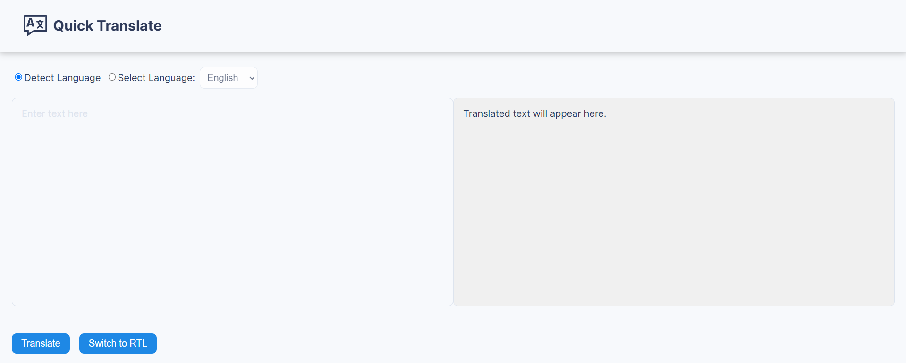

# Quick Translate

[](https://quick-translate-ojfd1p7yi-aathifzahirs-projects.vercel.app/) [](https://react.dev/) [](https://axios-http.com/) [](LICENSE) [](https://jestjs.io/) [](https://prettier.io/)

Quick Translate is a simple translation app built with ReactJS. It allows users to input text, translate it using Google's Translation API, and supports features like text direction switching, character limits, and language detection.



## 🚀 Live Demo

[Visit Quick Translate](https://quick-translate-ojfd1p7yi-aathifzahirs-projects.vercel.app/)

## 🛠️ Features

- **Language Detection:** Automatically detect the input language.
- **Multi-Language Support:** Translate text into multiple languages, including English, Spanish, French, Arabic, and more.
- **Character Limit:** Enforces a maximum character limit of 1000 for input text.
- **Text Direction:** Switch between Left-to-Right (LTR) and Right-to-Left (RTL) directions.
- **Error Handling:** Displays toast notifications for errors like empty input or API failures.
- **Responsive Design:** Fully optimized for all screen sizes.

## 📖 API Documentation

- Quick Translate integrates the [Google Translation API](https://cloud.google.com/translate/docs) for translations.
- For more information, see the [Google Translation API Documentation](https://cloud.google.com/translate/docs).

## ⚠️ Error Handling

- **Empty Input:** Displays a toast notification saying, "Input cannot be empty."
- **Character Limit Exceeded:** Warns the user if the input exceeds 1000 characters.
- **API Failure:** Alerts users with "Translation failed. Please try again later."

## 🖥️ Tech Stack

- **Frontend:** ReactJS, CSS
- **API Integration:** Google Translation API (via Axios)
- **Hosting:** Vercel
- **Testing:** React Testing Library, Jest
- **Styling:** Custom CSS with variables

## 🏗️ Installation

1. Clone the repository:

   ```bash
   git clone https://github.com/aathifzahirs-projects/quick-translate.git
   ```

2. Navigate to the project directory:

   ```bash
   cd quick-translate
   ```

3. Install dependencies:

   ```bash
   npm install
   ```

4. Create a `.env` file in the root directory and add your Google API Key:

   ```env
   REACT_APP_GOOGLE_API_KEY=your_api_key
   ```

5. Start the development server:

   ```bash
   npm start
   ```

6. Open [http://localhost:3000](http://localhost:3000) in your browser.

## 📁 Folder Structure

```
src/
├── assets/              # Static assets (e.g., images)
├── components/          # Reusable components
├── styles/              # CSS files
├── App.js               # Main application component
├── App.css              # Application styling
├── index.js             # React DOM render
├── index.css            # Global styles
└── .env                 # API Key configuration
```

## 🧪 Running Tests

To run tests, use the following command:

```bash
npm test
```

## 🤝 Contribution Guidelines

Contributions are welcome! Follow these steps to contribute:

1. Fork the repository.
2. Create a new branch with a descriptive name (e.g., `feature/rtl-support`).
3. Make your changes, ensuring they align with the code style (Prettier is recommended).
4. Commit changes with clear messages.
5. Submit a pull request and wait for feedback.

For more details, refer to [CONTRIBUTING.md](CONTRIBUTING.md) (if available).

## 📝 License

This project is licensed under the MIT License. See the [LICENSE](LICENSE) file for details.

## 🫂 Support

Star this project to show your support. Made with ❤️ by Aathif Zahir.
